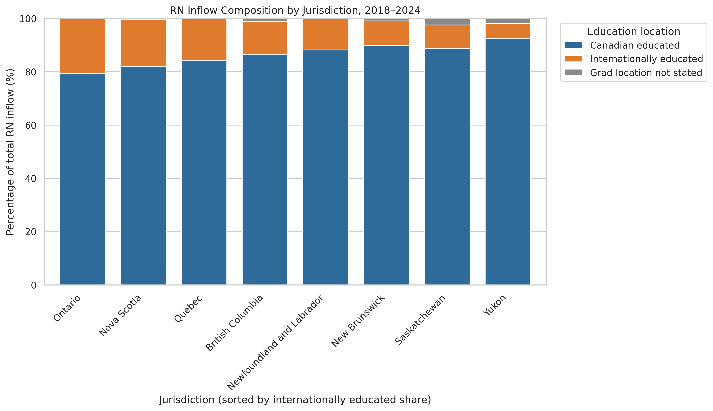
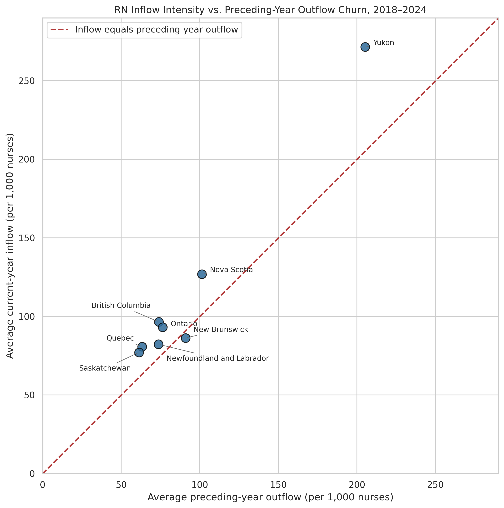
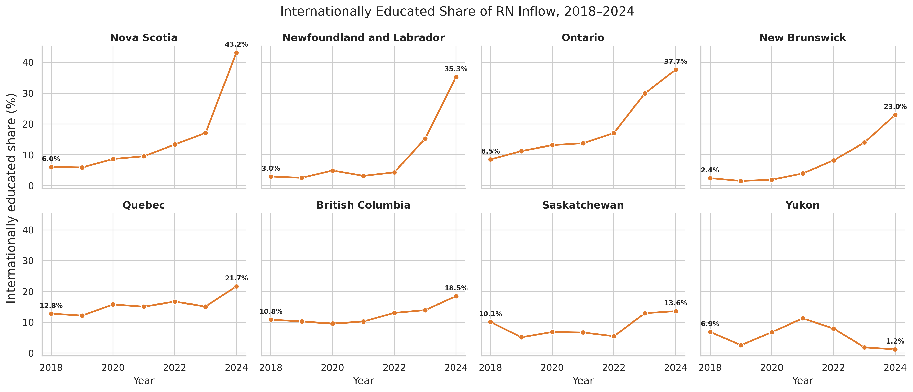

# Registered Nurse Workforce Dynamics Across Canada, 2018–2024

[](https://colab.research.google.com/github/makobhakub/canadian-rn-workforce-analysis/blob/main/registered_nurse_workforce_dynamics_2018_2024.ipynb)

A reproducible Python analysis of registered-nurse workforce inflow, outflow, and international recruitment across Canadian jurisdictions using Canadian Institute for Health Information (CIHI) data.

The project emphasizes transparent temporal alignment, explicit missing-data handling, validation, and evidence-based interpretation. The executed notebook is the main portfolio deliverable.

## Research questions

1. How did the composition of RN inflow differ across jurisdictions?
2. How did current-year inflow compare with preceding-year outflow after accounting for workforce size?
3. How did the internationally educated share of RN inflow change from 2018 to 2024?

## Key findings

- Ontario had the largest aggregate internationally educated share of RN inflow among the eight complete-series jurisdictions (20.60%), followed by Nova Scotia (17.69%) and Quebec (15.73%).
- Average inflow exceeded preceding-year outflow in seven of eight jurisdictions. New Brunswick was slightly below the break-even line: 86.30 inflows versus 90.88 preceding-year outflows per 1,000 nurses.
- The internationally educated share increased from 2018 to 2024 in seven of eight jurisdictions. The largest changes occurred in Nova Scotia (+37.21 percentage points), Newfoundland and Labrador (+32.30), and Ontario (+29.17). Yukon declined by 5.65 percentage points.

## Figures

### 1. RN inflow composition

Aggregate composition of reported RN inflow from 2018 through 2024, ordered by the internationally educated share.



### 2. Inflow intensity versus preceding-year outflow churn

Average annual inflow and preceding-year outflow per 1,000 nurses in the preceding-year workforce. The dashed 45-degree line marks break-even.



### 3. Internationally educated share of annual RN inflow

Annual trends for the eight complete-series jurisdictions, shown with a common y-axis for direct comparison.



## Methodology

- Retain 2017 only as the baseline needed to calculate 2018 longitudinal measures.
- Analyze the 2018–2024 reporting window.
- Preserve missing and suppressed source values as `NaN`; never replace them silently with zero.
- Calculate longitudinal measures only when the earlier observation is from the immediately preceding calendar year.
- Define workforce change as workforce in year *t* minus workforce in year *t−1*.
- Define net flow as inflow in year *t* minus outflow in year *t−1*.
- Normalize current inflow and preceding-year outflow by the preceding-year workforce.
- Restrict the three figures to the eight jurisdictions with all seven analysis years and every required field: British Columbia, New Brunswick, Newfoundland and Labrador, Nova Scotia, Ontario, Quebec, Saskatchewan, and Yukon.

## Validation

The pipeline verifies jurisdiction-year uniqueness, strict inflow-component reconciliation, consecutive-year alignment, complete-series availability, and the workforce-change decomposition discrepancy.

The executed final run produced:

- 0 duplicate jurisdiction-year rows
- 0 inflow reconciliation mismatches
- 8 complete-series jurisdictions
- 0 notebook execution errors

## Repository contents

| Path | Purpose |
| --- | --- |
| [`registered_nurse_workforce_dynamics_2018_2024.ipynb`](registered_nurse_workforce_dynamics_2018_2024.ipynb) | Executed portfolio notebook with explanations, validation output, tables, and charts |
| [`canadian_nursing_workforce_analysis.py`](canadian_nursing_workforce_analysis.py) | Standalone Python version of the complete analytical pipeline |
| [`outputs/`](outputs/) | Three publication-ready figures exported at 300 DPI |
| [`requirements.txt`](requirements.txt) | Python dependencies |

## Reproduce the analysis

### Google Colab

Open the notebook using the Colab badge above, then select **Runtime → Run all**. The notebook downloads the CIHI workbook automatically.

### Local Python

```bash
git clone https://github.com/makobhakub/canadian-rn-workforce-analysis.git
cd canadian-rn-workforce-analysis
python -m venv .venv
source .venv/bin/activate  # On Windows: .venv\Scripts\activate
pip install -r requirements.txt
python canadian_nursing_workforce_analysis.py
```

The raw workbook is not committed to this repository. On the first run, the script downloads it to `data/`; in Colab, it downloads to `/content/`.

## Data source

Canadian Institute for Health Information, *Nursing in Canada, 2016–2025: Data Tables*, Table 4a and Definitions sheet: [source workbook](https://www.cihi.ca/sites/default/files/document/nursing-in-canada-2016-2025-data-tables-en.xlsx).

## Limitations

- Complete-series comparisons exclude Manitoba because 2019–2024 observations are unavailable and Alberta because 2024 is unavailable.
- Prince Edward Island and Northwest Territories/Nunavut also fail the strict completeness requirements used for the figures.
- This is a descriptive analysis and does not identify causal effects.
- CIHI outflow should not be interpreted specifically as retirement.
- The simplified inflow/outflow framework may not capture every source-data revision or workforce movement; the decomposition discrepancy is inspected rather than assumed to be zero.

